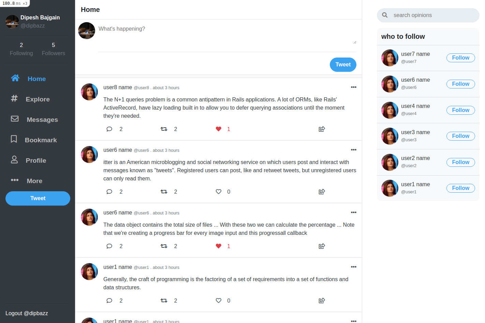

# Twitter redesign

## Table of contents

- [About](#about)
- [Features](#features)
- [Built with](#built-with)
- [Getting started](#getting-started)
  * [Prerequisites](#prerequisites)
  * [Installation instructions](#installation-instructions)
- [Authors](#authors)
- [Contributing](#-contributing)
- [Show your support](#show-your-support)
- [Acknowledgements](#acknowledgments)
- [License](#-license)

---

## About

This project is about creating a twitter redesign. The screenshot of homepage of the project is as below.



The ER diagram used to create the model for this project is as below:


## Features

The features of this project are, user can:

1. register and login to the application.
2. follow or unfollow other users.
3. create an opinion.
5. view all opinions.
4. like or dislike the opinion.
5. view other user profile and their follower and following.

## Live Demo

This project is hosted on heroku.

[Live demo link](https://twitter-design.herokuapp.com/)
## Built With

- Ruby v2.7.1
- Rails v6.1.0
- postgresql v12.6

## Getting Started

### Prerequisites

If you intend to download the project, you will need to have

1. Ruby >= 2.7.1

    For more information on how to install Ruby, follow [this link](https://www.ruby-lang.org/en/downloads/)

2. Ruby on rails >= 6.1.0

    After ruby is installed run cmd `gem  rails`

3. postgresql >= 12.6

    For installing postgresql [follow this link](http://postgresguide.com/setup/install.html)


### Installation instructions

Follow along the steps below to get a copy at your local machine.

- Navigate to the directory where you want this project to clone and then clone it

    ```
    git clone https://github.com/dipbazz/twitter_redesign.git
    ```

- Navigate to the `twitter_redesign` directory

    ```
    cd twitter_redesign
    ```

- Setup credentials for cloudinary account for image upload feature.

    ```
    EDITOR="code --wait" bin/rails credentials:edit
    ```

    use the choice of your editor in my case I am
    using vscode to edit credentials file.
    To use command line editor like `nano` or `vim` remove `--wait` flag. Example:

    ```
    EDITOR="nano" bin/rails credentials:edit
    ```

    Update the `credentials.yml.enc` with your details from cloudinary account.

    ```
    CLOUDINARY:
        NAME: your_cloudinary_name
        API_KEY: cloudinary_key
        API_SECRET: cloudinary_secret_key
    ```

- install the gem package

    ```
    bundle install
    ```

- install yarn packages
    ```
    yarn install
    ```

- Create your database
    ```
    rails db:create
    ```

- Migrate the database

    ```
    rails db:migrate
    ```

- Start your server

    ```
    rails server
    ```

- Open browser at http://localhost:3000/

## Testing

To test the project run the below cmd from your project root directory.
```
rspec

OR

rspec --format doc
```


If you want to populate initial user data instead of creating it for manual testing you can run
```
rails db:seed
```
which will create default user with username starting from `user1` - `user8` with password: `Test@123`

## Authors

👤 **Dipesh Bajgain**

- GitHub: [@dipbazz](https://github.com/dipbazz)
- Twitter: [@dipbazz](https://twitter.com/dipbazz)
- LinkedIn: [Dipesh Bajgain](https://www.linkedin.com/in/dipbazz/)

## 🤝 Contributing

Contributions, issues, and feature requests are welcome!

## Show your support

Give a ⭐️ if you like this project!

## Acknowledgments

- Cover image used in profile page is by [eberhard grossgasteiger](https://unsplash.com/@armedshutter) on [Unsplash](https://unsplash.com/s/photos/nature)

- Profile image used as user profile is by [Ayo Ogunseinde](https://unsplash.com/@eberhardgross) on [Unsplash](https://unsplash.com/s/photos/girls)

- Icons used for this project is from [Font awesome](https://fontawesome.com/)

## 📝 License

This project is [MIT](./LICENSE) licensed.
